# Channel Studio

Your private production desk for **Walter's Home Check** and **Chef Sal Romano**.
Plan videos on a board, make the Project Crafter prompt in one click, build perfect
YouTube descriptions with the right product links, and tick off the publish checklist.
Plan the Shorts you cut from each video, test titles and thumbnail text, and look back
at every week.

- Works in the browser — nothing to install on a server.
- Your data stays **only on your device**. Nothing is sent anywhere. No accounts, no tracking.
- Works **offline** after the first visit.
- Search engines are told not to list it.

> **Shorts Factory (Mac tool):** turn one long video into 5–8 ready-to-post Shorts with
> captions, hook bar, cover, title and description — see
> [shorts_factory/README.md](shorts_factory/README.md).

---

## 1. Open the app

After GitHub Pages is turned on (see the next section), the address is:

**https://plazzers.github.io/channel-studio/**

Bookmark it. The first time it opens you will see the starter videos.

> **Please check:** four Walter videos ("9 Things to Check Before Winter", "Do These 7 Things
> Before Bed", "If Your House Was Built Before 1990" and "7 Small House Problems") were added
> as **Scheduled** without a date, because their real status wasn't known. Open each one and set
> the right stage and date.

## 2. Turn on GitHub Pages (one time)

1. Open https://github.com/plazzers/channel-studio
2. Click **Settings** (top of the page) → **Pages** (left menu).
3. Under **Build and deployment** → **Source**, choose **Deploy from a branch**.
4. Under **Branch**, choose **main** and **/ (root)**, then click **Save**.
5. Wait 1–2 minutes and refresh. The page shows "Your site is live at …".

The repository can stay private if your GitHub plan allows Pages for private repos. On the
free plan the repository has to be public for Pages to work. Even then, the app has none of
your data in it: your videos live only in your browser.

## 3. Install it like an app

**On the Mac (Chrome):** open the app address, click the **Install** icon at the right end of
the address bar (a small screen with an arrow), then **Install**. It now has its own window and
a Dock icon.
**On the Mac (Safari):** menu **File → Add to Dock**.

**iPhone:** open the address in Safari → **Share** button → **Add to Home Screen**.
**Android:** open it in Chrome → **⋮** menu → **Install app**.

> Each device has its **own separate copy** of your data. To move data between the Mac and
> the phone, use Backup → Export on one and Import on the other.

## 4. Everyday use

### Board
- The **Walter / Sal / Both** switch at the top shows one channel or both.
- Type a title in **+ New idea**, pick the channel, press **Add idea** (or Enter).
  If it sounds like an old video, you'll see **"Similar to: …"**.
- **Move a card:** drag it to another column on the Mac. On the phone (or anywhere), use the
  small **Move to…** menu on the card. On the phone, the round stage buttons above the board
  jump to that column.
- Click a card's title to open the video.

### Video page (tabs)
- **Overview** — working title, title options A/B/C (orange warning above 70 characters),
  thumbnail text (red warning when half or more of its words are in the title, orange when it
  shares one), main product, length and spoken-word target, publish date/time (ET), stage.
- **Title lab** — see the next section.
- **Crafter prompt** — fields are pre-filled from your defaults. Type the points/segments one
  per line. Press **Copy prompt**. The last line `create me a prompt for the video` is always
  added automatically and can't be changed. There is no SOURCES section.
- **Description** — write the hook, tick the product lines (main product goes first), paste
  chapters like `0:00 Intro` or add rows. Mistakes are shown in red (first chapter must be
  0:00, at least 3 chapters, 10+ seconds apart, times going up). Press **Copy description**.
  Below it: the **pinned comment** and **community post**, and the **"Insert a product line
  into an old description"** helper — paste an old description, pick the product, press
  **Insert line**, check the green line, then **Copy new description**.
- **Shorts** — see "Shorts" below.
- **Checklist** — tick items as you publish. "Description copied" ticks itself, and so does
  "Shorts cut from this video" once a Short is marked Cut or Posted.
- **Notes** — free text plus links to the script doc, Headcast project and thumbnail file.

Every "Export to file" button saves the text as a `.txt` file.

### Title lab (tab on each video)

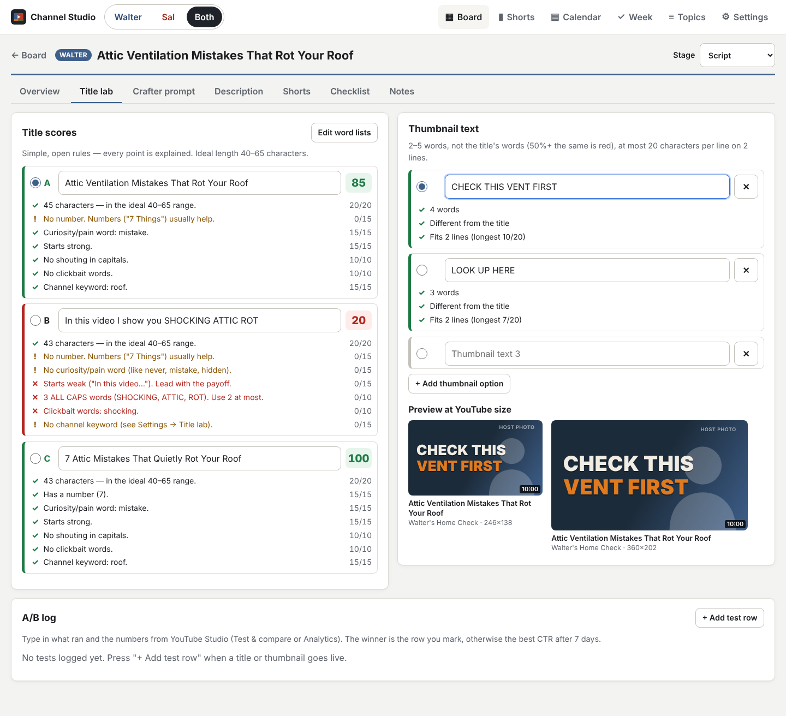

- **Title scores** — each title option A/B/C gets a score out of 100, and every point is
  explained underneath, so you can see exactly why:

  | Rule | Points |
  |---|---|
  | Length 40–65 characters (30–39 or 66–75 gets half) | 20 |
  | Has a number ("7 Things") | 15 |
  | Has a curiosity/pain word (never, mistake, hidden, …) | 15 |
  | Starts strong — not "How I…", "In this video…", "In today's video…", "This video…" | 15 |
  | At most 2 ALL CAPS words | 10 |
  | No clickbait words ("shocking", "you won't believe", …) — red warning | 10 |
  | Has one of the channel's keywords | 15 |

  The word lists are in **Settings → Title lab**: channel keywords (Walter: home inspection,
  house, homeowner, buying a house, winter, basement, roof; Sal: restaurant, chef, copycat,
  recipe, menu, Italian), curiosity/pain words and clickbait words. Each has a **Reset** button.
- **Thumbnail text** — 2–5 words; red when 50% or more of its words are in the title; red when
  it doesn't fit **2 lines of 20 characters**. The round button picks which option is shown in
  the **preview**: a mock thumbnail at real YouTube sizes (246×138 and 360×202) in the
  channel's colors with a host-photo placeholder, so you can judge readability.
- **A/B log** — press **+ Add test row** when a title/thumbnail goes live. Type the start date,
  what ran, and the CTR % and views after 48 hours and after 7 days (from YouTube Studio
  "Test & compare" or Analytics). The winner is the row you tick, otherwise the best 7-day CTR
  (then 48-hour CTR, then views).

### Shorts

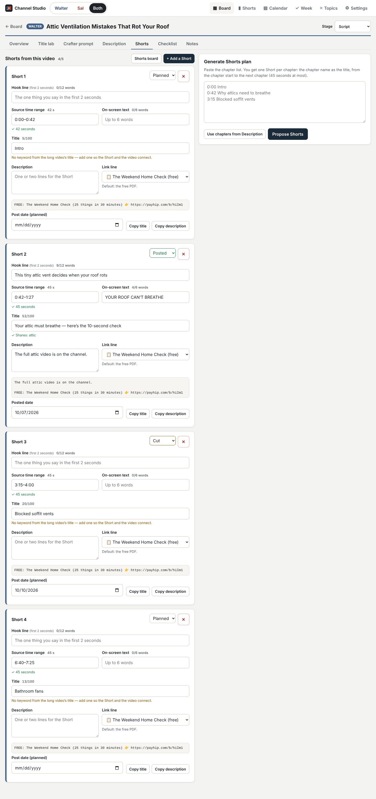

- On each video's **Shorts** tab, plan up to **5 Shorts**. For each one: hook line (first 2
  seconds, max 12 words), source time range like `1:05–1:50` (must be **15–60 seconds**; the
  length is shown), on-screen text (max 6 words), title (max 100 characters; orange warning if
  it has no word from the long video's title), description with a link line (default: the free
  PDF), status **Planned / Cut / Posted**, and the post date. **Copy title** and
  **Copy description** are on each Short.
- **Generate Shorts plan** — paste the chapter list (or press **Use chapters from Description**),
  press **Propose Shorts**: one Short per chapter, titled after the chapter, from the chapter
  start to the next chapter or 45 seconds, whichever comes first. Untick the ones you don't
  want and press **Add selected Shorts**.
- The **Shorts** page (bottom/top menu) shows every Short in Planned / Cut / Posted columns,
  with a status menu on each card, a status filter, and a **week strip** (Mon–Sun) showing
  Shorts on their post date. The Walter/Sal/Both switch works here too.

### Week (weekly review)

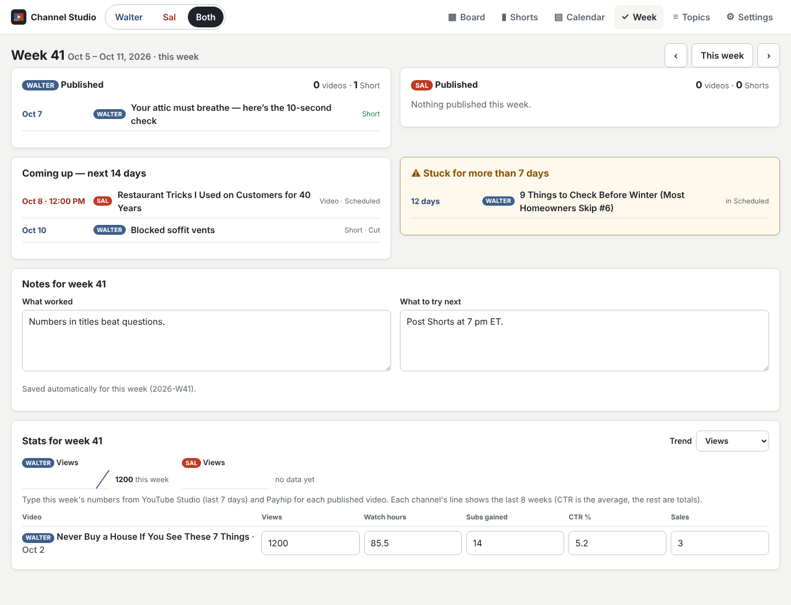

- What was **published this week** per channel (videos and Shorts), what's **coming up in
  the next 14 days**, and cards **stuck in the same stage for more than 7 days** (published
  videos and scheduled ones with a date don't count). Use ‹ › to look at other weeks.
- **Notes for the week** — "What worked" and "What to try next", saved per week
  (ISO weeks, Monday to Sunday).
- **Stats** — type each published video's numbers for the week (views, watch hours, subs
  gained, CTR %, Payhip sales). A small line per channel shows the last 8 weeks; pick the number
  to follow under **Trend** (CTR is averaged, the others are added up).

> Cards made before this update don't know when they entered their stage, so the "stuck" list
> uses their last edit date until they are moved once.

### Calendar and Topics
- **Calendar** — month view of scheduled (outlined) and published (solid) videos. Click one to open it.
- **Topics** — every title ever used, per channel, with a box to check a new idea against them.

### Keyboard shortcuts (Mac)
| Key | What it does |
|---|---|
| **N** | New idea |
| **/** | Search |
| **⌘ + Enter** | Copy the prompt or description you are looking at |

## 5. Back up your data (do this weekly)

**Settings → Backup → Export backup file.** A file like
`channel-studio-backup-2026-10-07.json` is downloaded. It has everything: videos, Shorts, A/B
log, weekly notes, stats and settings. Keep it in iCloud Drive or Google Drive.

**Settings → Backup → Export CSV files (.zip)** downloads `channel-studio-csv-<date>.zip`
with one spreadsheet file per table — `videos.csv`, `shorts.csv`, `ab_log.csv`,
`weekly_notes.csv`, `stats.csv` — for Numbers, Excel or Google Sheets. This is for reading
and analysis; to restore data, use the backup file.

Backup files made before this update still import fine (they just have no Shorts or stats).

To restore (or move to another device): **Settings → Backup → Import backup** and pick the file.
This **replaces everything** in the app with what's in the file.

**Reset to demo data** wipes everything and brings back the starter videos. Export a backup first!

> Clearing your browser's "site data" or "cookies and website data" also deletes the app's
> data. Another reason to export backups.

## 6. Change products, links, hashtags and defaults

Everything is in **Settings**:

- **Channel & products** — pick Walter or Sal at the top, then edit:
  - each product's name, description line text, link, price, type (free/paid/app), emoji,
    "In description by default", and order (↑ ↓). **+ Add product** for a new launch.
  - store link, default hashtags, sign-off line, words per minute, default length,
    the description line style (e.g. `{emoji} {text} → {url}`), and the pitch rule reminder.
  - the pinned comment and community post templates.
- **Prompt defaults** — NARRATOR, AUDIENCE, OUTPUT FORMAT, STRUCTURE, SAFETY/ACCURACY,
  PRODUCT MENTIONS and STYLE RULES for each channel.
- **Checklist** — add, remove, reword or reorder the publish checklist items.
- **Theme** — System, Light or Dark.

Changes save automatically. They only change **this device** (back up and import to copy them).

**When a new product launches:** add it in Settings → Channel & products, then use the
"Insert a product line" helper on the Description tab to update old videos one by one.

## 7. Self-tests

Open **https://plazzers.github.io/channel-studio/tests/tests.html**. It checks the prompt
format, chapter rules, the description builder, the insert helper, the similar-topic check,
Shorts time ranges, the chapters → Shorts generator, title scoring, the thumbnail rules, the
A/B winner, ISO week math, CSV, the ZIP writer and the database upgrade (old data kept).
Everything should show green ✓.

---

## For a developer (optional)

- Plain HTML + CSS + JavaScript modules, no build step, no libraries. Data is in IndexedDB.
- `data/channels.js` holds the default channel settings (incl. title keywords), `data/seed.js`
  the starter videos, `js/logic.js` all the rules (tested by `tests/tests.html`),
  `js/zip.js` a minimal store-only ZIP writer (+ CRC-32), `js/export.js` the CSV tables.
- Database version 2 (`js/db.js`) only **adds** stores — `shorts`, `abtests`, `weekly`,
  `stats` — next to the original `videos` and `kv`; nothing old is changed. Videos get an
  optional `statusSince` field; channels an optional `keywords` list (filled from the defaults
  when missing). Backup files are version 2; version 1 files are still accepted.
- If you change app files, bump `VERSION` in `sw.js` (now `cs-v2`) so installed copies refresh
  their offline files.
- Full browser check (desktop 1440×900 and phone 390×844, plus an upgrade run on top of a
  version-1 database) with Playwright: `node tests/e2e.cjs` (writes screenshots to
  `docs/screens/`; the CSV zip is opened with Python by `tests/check_zip.py`).

### Screenshots
| Desktop | Phone |
|---|---|
|  |  |
|  |  |
|  |  |
|  |  |
| 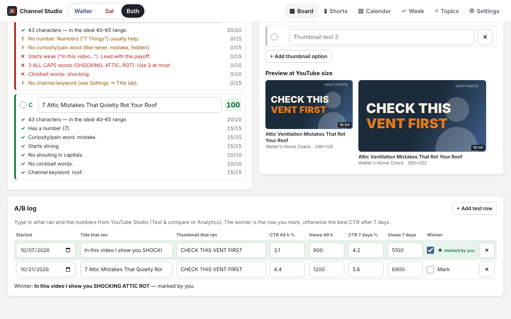 | 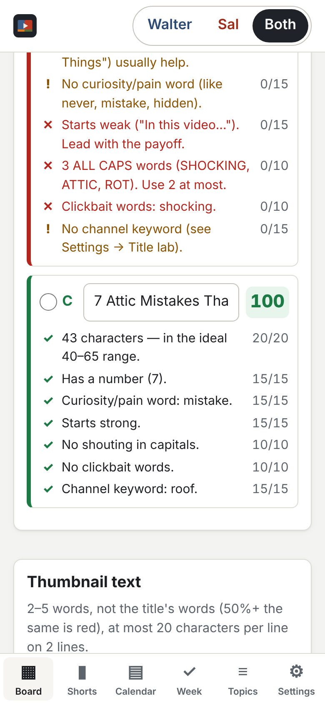 |
| 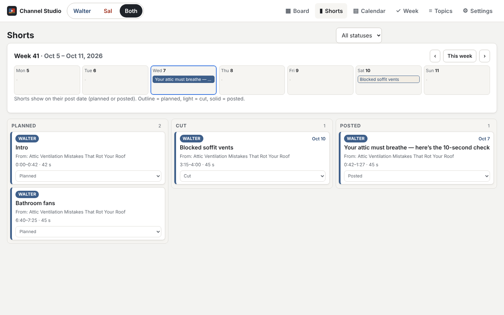 | 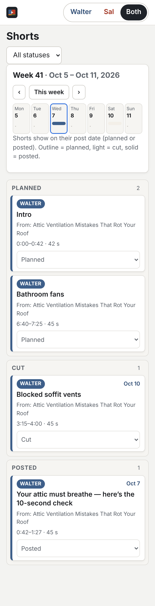 |
| 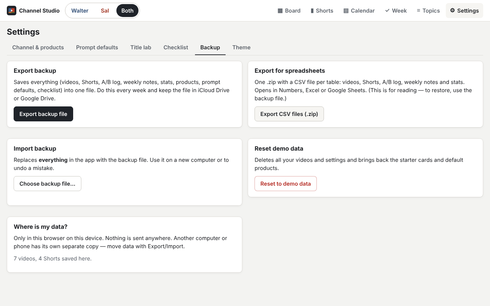 | 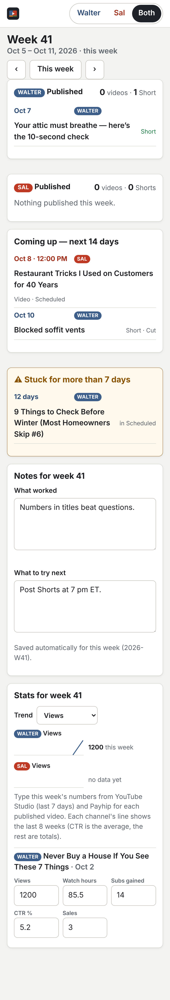 |
| 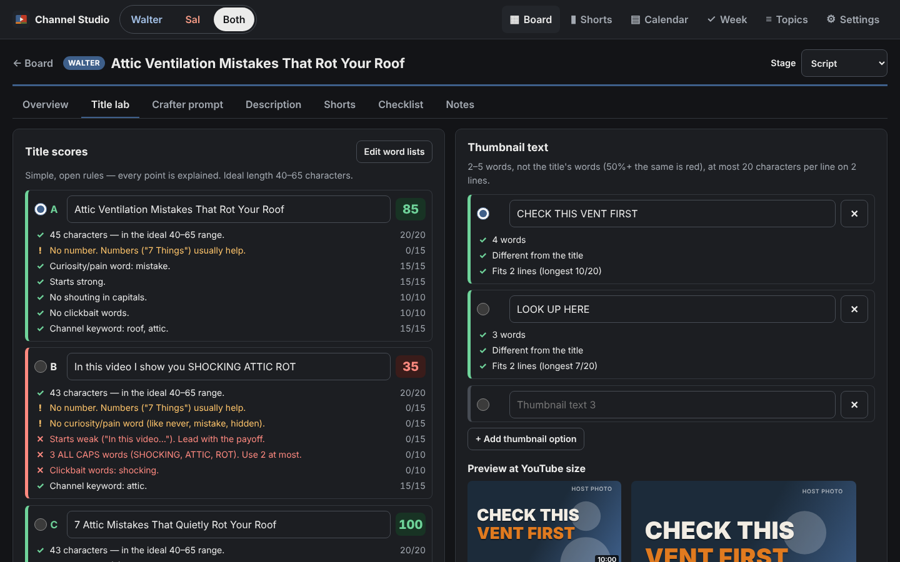 | 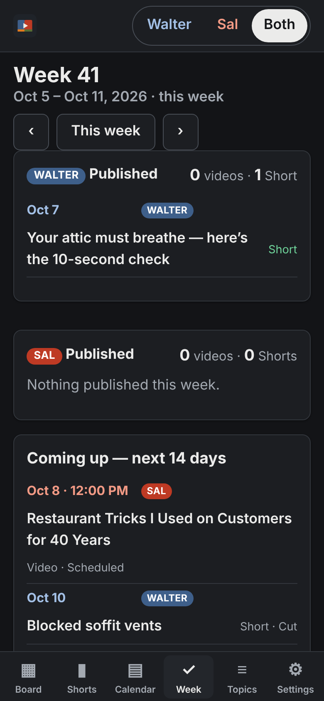 |

---

# Faceless Creator Kit

A separate, sellable app for **other** creators, in the `kit/` folder. It is a generic,
clean version of Channel Studio (the **Channel Planner**) plus a **Pin Factory** that makes
Pinterest pins in the browser. It has its own look, its own data, its own offline worker and
its own install icon — it shares nothing with Channel Studio, so changing one never breaks
the other. Nothing about Walter or Sal is in it.

**Address (once GitHub Pages is on):** https://plazzers.github.io/channel-studio/kit/

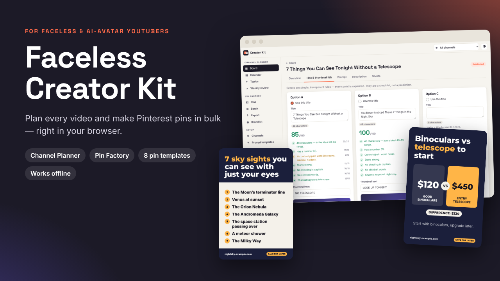

## What buyers get
- **Access gate:** the first screen asks for an access code from their PDF guide.
- **Channel Planner:** any number of channels; board (Idea → Script → Voice/Avatar → Edit →
  Thumbnail → Scheduled → Published), calendar, topics bank, prompt builder with 3 templates
  (they can edit them and add their own with a fixed ending line), description builder, title
  & thumbnail lab with an explained score, Shorts planner, weekly review with trend lines,
  backup/restore and CSV export. A 3-step welcome and a demo channel they can delete.
- **Pin Factory:** brand kit per channel (colors, 6 fonts, logo in a circle, footer, CTA), 8
  pin templates (1000×1500), single-pin editor with undo/duplicate, batch mode (paste a sheet
  or upload a CSV), and export to a ZIP of PNG/JPG images + a Pinterest bulk-upload CSV with
  image links, UTM tags, a schedule and length checks.

## Selling it — what you (or your assistant) do
1. **Make access codes** (on your Mac, in the repo folder):
   `python3 kit/tools/make_codes.py --count 50 --out ~/Desktop/kit-codes.txt`
   It saves the codes in that file (keep it private — never put it in the repo) and prints a
   list of hashes. Paste the hashes into `ACCESS_HASHES` in `kit/config.js`, commit and push.
   The list is empty now, so **no code works until you do this**.
2. **Make each buyer's PDF** with their code in it:
   `python3 kit/tools/make_access_pdf.py --code KIT-XXXX-XXXX --out ~/Desktop/Guide-KIT-XXXX-XXXX.pdf`
   (needs `pip3 install reportlab pillow` once).
3. **Payhip listing:** text in `kit/sales/payhip-description.md` (add your own refund
   wording), images `kit/sales/cover-1280x720.png`, `cover-square-1400.png` and
   `feature-1…6-*.png`. The general guide without a code is
   `kit/sales/Faceless-Creator-Kit-Guide.pdf` (made from `kit/sales/buyer-guide.md`).

The code check happens in the browser, so it keeps honest people honest — it is not strong
copy protection.

## For a developer
- Plain HTML/CSS/JS modules, no build, no network calls at runtime. Data in IndexedDB
  (`faceless-creator-kit`). Fonts (OFL) are in `kit/fonts/`.
- Test mode: on `localhost`, open `kit/?testcode=1` and use `KIT-TEST-0000`.
- If you change kit files, bump `VERSION` in `kit/sw.js` (now `fck-v1`).
- Unit tests: `node --test kit/tests/unit.test.mjs` · Browser test at 1440×900 and 390×844:
  `node kit/tests/e2e.cjs` (screenshots in `kit/docs/screens/`, the export ZIP and CSV are
  opened and checked with Python).
- Rebuild sales material: `node kit/tools/make_sales_images.cjs` and
  `python3 kit/tools/build_guide.py`.

| Desktop | Phone |
|---|---|
| 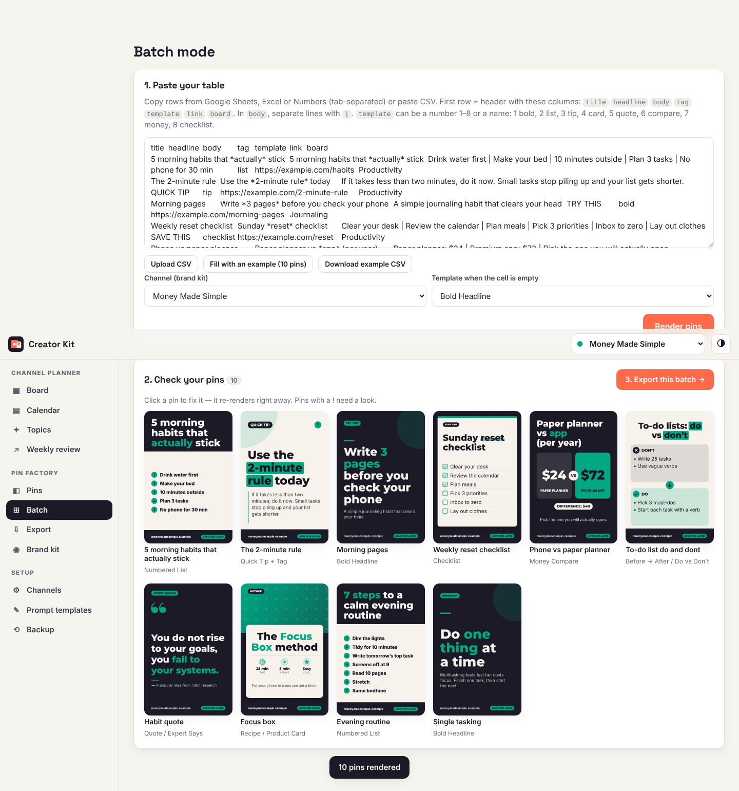 | 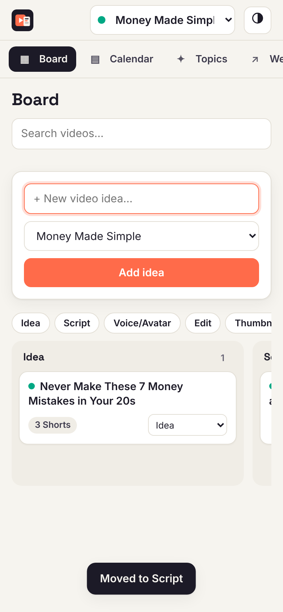 |
| 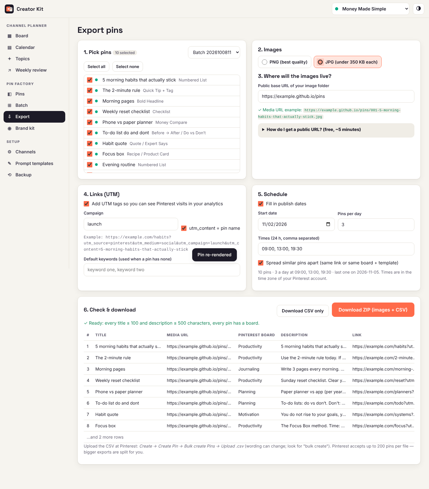 | 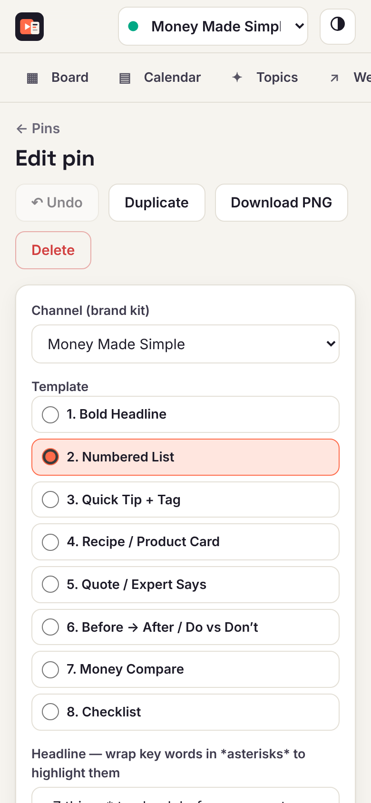 |
