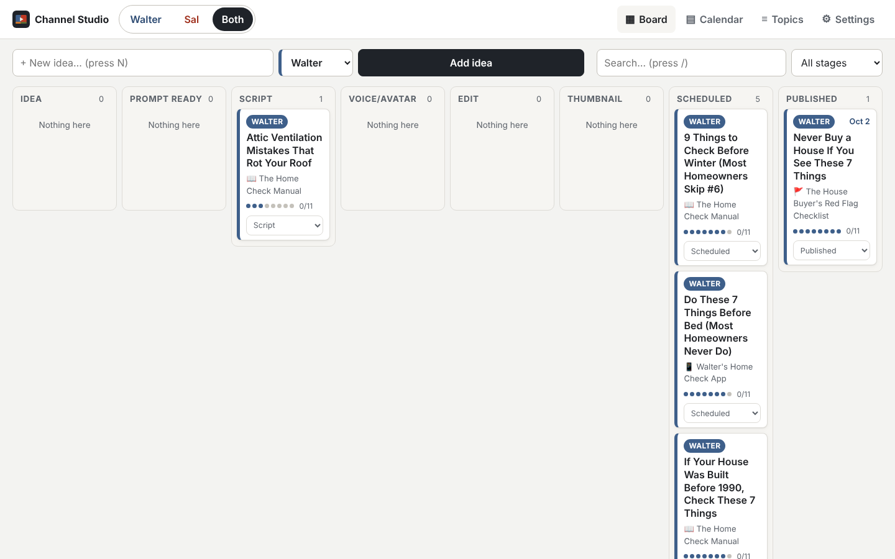
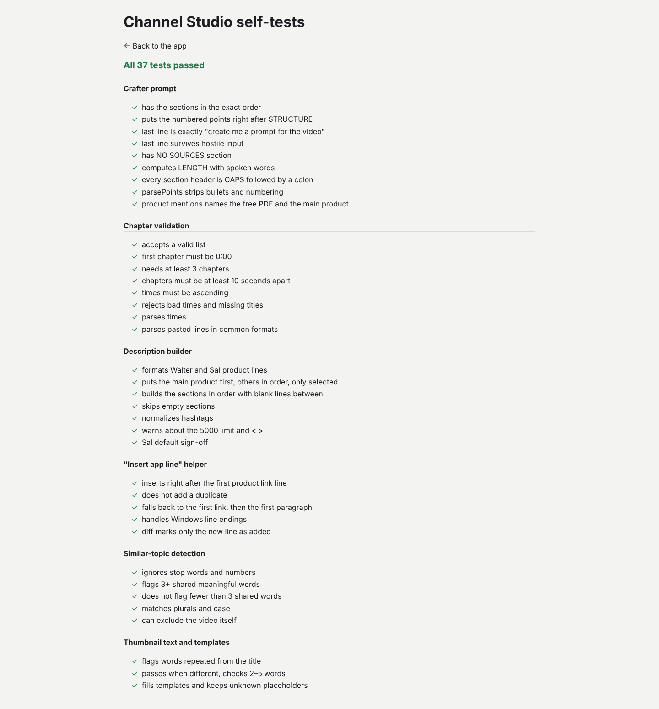
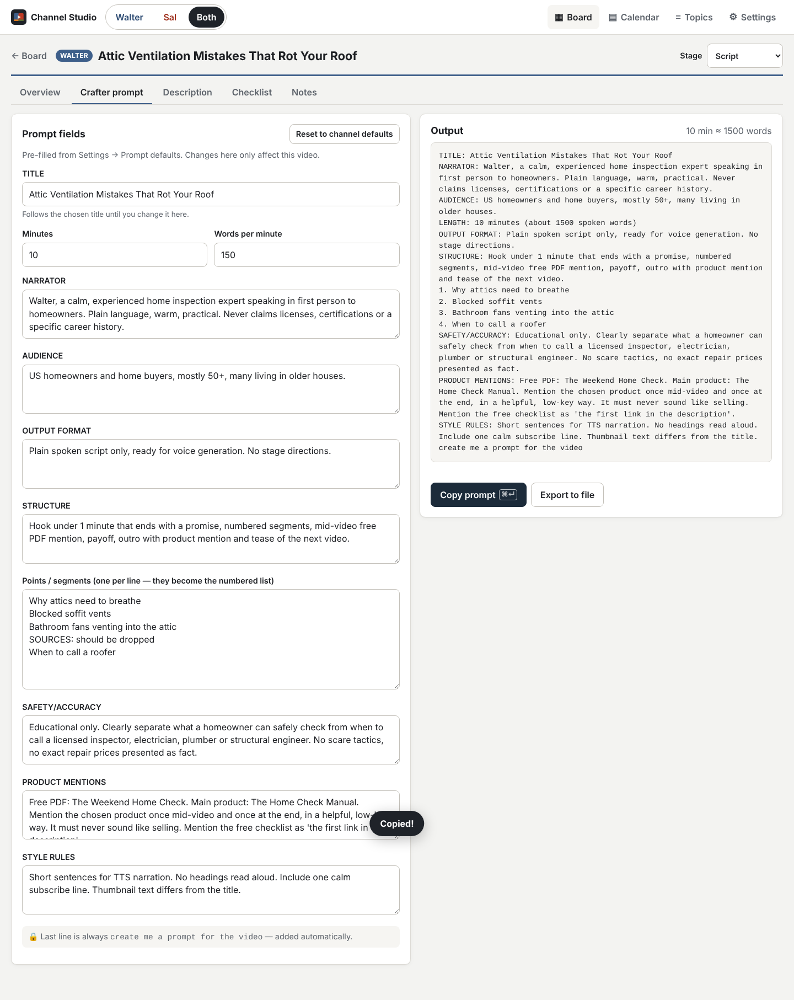
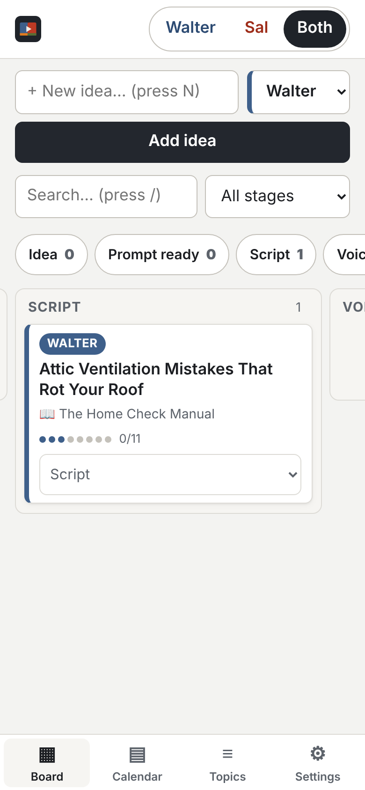
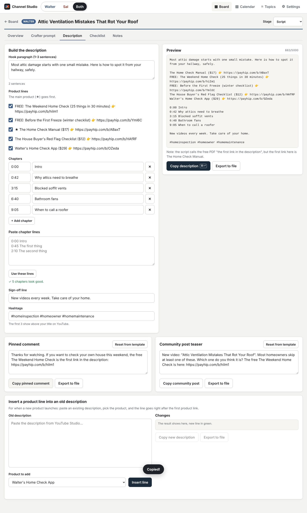
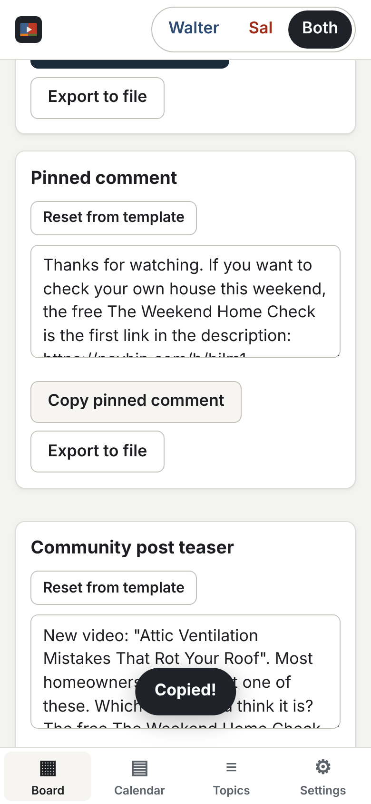
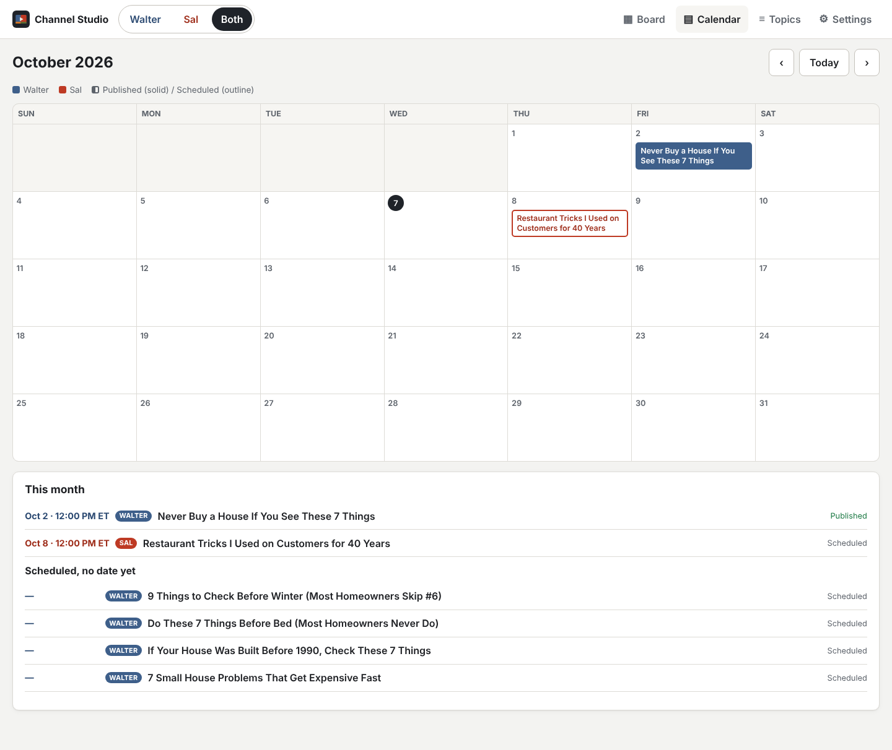
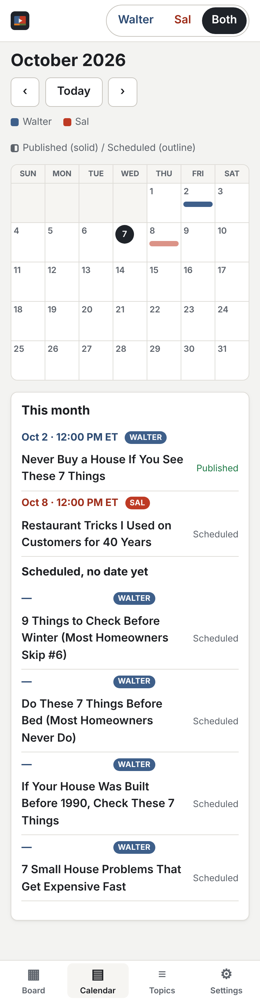
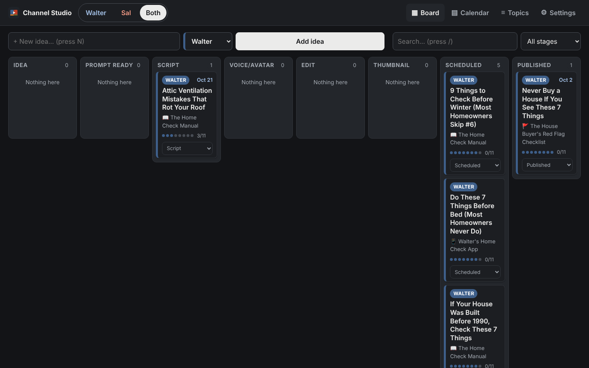
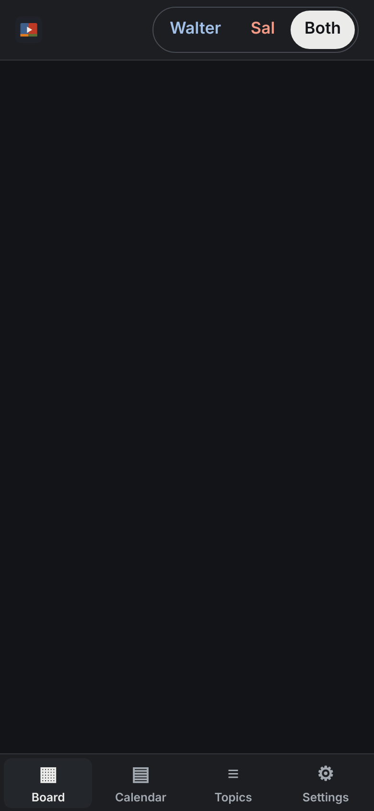

# Channel Studio

Your private production desk for **Walter's Home Check** and **Chef Sal Romano**.
Plan videos on a board, make the Project Crafter prompt in one click, build perfect
YouTube descriptions with the right product links, and tick off the publish checklist.

- Works in the browser — nothing to install on a server.
- Your data stays **only on your device**. Nothing is sent anywhere. No accounts, no tracking.
- Works **offline** after the first visit.
- Search engines are told not to list it.

---

## 1. Open the app

After GitHub Pages is turned on (see the next section), the address is:

**https://plazzers.github.io/channel-studio/**

Bookmark it. The first time it opens you will see the starter videos.

> **Please check:** four Walter videos ("9 Things to Check Before Winter", "Do These 7 Things
> Before Bed", "If Your House Was Built Before 1990" and "7 Small House Problems") were added
> as **Scheduled** without a date, because their real status wasn't known. Open each one and set
> the right stage and date.

## 2. Turn on GitHub Pages (one time)

1. Open https://github.com/plazzers/channel-studio
2. Click **Settings** (top of the page) → **Pages** (left menu).
3. Under **Build and deployment** → **Source**, choose **Deploy from a branch**.
4. Under **Branch**, choose **main** and **/ (root)**, then click **Save**.
5. Wait 1–2 minutes and refresh. The page shows "Your site is live at …".

The repository can stay private if your GitHub plan allows Pages for private repos. On the
free plan the repository has to be public for Pages to work. Even then, the app has none of
your data in it: your videos live only in your browser.

## 3. Install it like an app

**On the Mac (Chrome):** open the app address, click the **Install** icon at the right end of
the address bar (a small screen with an arrow), then **Install**. It now has its own window and
a Dock icon.
**On the Mac (Safari):** menu **File → Add to Dock**.

**iPhone:** open the address in Safari → **Share** button → **Add to Home Screen**.
**Android:** open it in Chrome → **⋮** menu → **Install app**.

> Each device has its **own separate copy** of your data. To move data between the Mac and
> the phone, use Backup → Export on one and Import on the other.

## 4. Everyday use

### Board
- The **Walter / Sal / Both** switch at the top shows one channel or both.
- Type a title in **+ New idea**, pick the channel, press **Add idea** (or Enter).
  If it sounds like an old video, you'll see **"Similar to: …"**.
- **Move a card:** drag it to another column on the Mac. On the phone (or anywhere), use the
  small **Move to…** menu on the card. On the phone, the round stage buttons above the board
  jump to that column.
- Click a card's title to open the video.

### Video page (tabs)
- **Overview** — working title, title options A/B/C (orange warning above 70 characters),
  thumbnail text (red warning if it repeats words from the title), main product, length and
  spoken-word target, publish date/time (ET), stage.
- **Crafter prompt** — fields are pre-filled from your defaults. Type the points/segments one
  per line. Press **Copy prompt**. The last line `create me a prompt for the video` is always
  added automatically and can't be changed. There is no SOURCES section.
- **Description** — write the hook, tick the product lines (main product goes first), paste
  chapters like `0:00 Intro` or add rows. Mistakes are shown in red (first chapter must be
  0:00, at least 3 chapters, 10+ seconds apart, times going up). Press **Copy description**.
  Below it: the **pinned comment** and **community post**, and the **"Insert a product line
  into an old description"** helper — paste an old description, pick the product, press
  **Insert line**, check the green line, then **Copy new description**.
- **Checklist** — tick items as you publish. "Description copied" ticks itself.
- **Notes** — free text plus links to the script doc, Headcast project and thumbnail file.

Every "Export to file" button saves the text as a `.txt` file.

### Calendar and Topics
- **Calendar** — month view of scheduled (outlined) and published (solid) videos. Click one to open it.
- **Topics** — every title ever used, per channel, with a box to check a new idea against them.

### Keyboard shortcuts (Mac)
| Key | What it does |
|---|---|
| **N** | New idea |
| **/** | Search |
| **⌘ + Enter** | Copy the prompt or description you are looking at |

## 5. Back up your data (do this weekly)

**Settings → Backup → Export backup file.** A file like
`channel-studio-backup-2026-10-07.json` is downloaded. Keep it in iCloud Drive or Google Drive.

To restore (or move to another device): **Settings → Backup → Import backup** and pick the file.
This **replaces everything** in the app with what's in the file.

**Reset to demo data** wipes everything and brings back the starter videos. Export a backup first!

> Clearing your browser's "site data" or "cookies and website data" also deletes the app's
> data. Another reason to export backups.

## 6. Change products, links, hashtags and defaults

Everything is in **Settings**:

- **Channel & products** — pick Walter or Sal at the top, then edit:
  - each product's name, description line text, link, price, type (free/paid/app), emoji,
    "In description by default", and order (↑ ↓). **+ Add product** for a new launch.
  - store link, default hashtags, sign-off line, words per minute, default length,
    the description line style (e.g. `{emoji} {text} → {url}`), and the pitch rule reminder.
  - the pinned comment and community post templates.
- **Prompt defaults** — NARRATOR, AUDIENCE, OUTPUT FORMAT, STRUCTURE, SAFETY/ACCURACY,
  PRODUCT MENTIONS and STYLE RULES for each channel.
- **Checklist** — add, remove, reword or reorder the publish checklist items.
- **Theme** — System, Light or Dark.

Changes save automatically. They only change **this device** (back up and import to copy them).

**When a new product launches:** add it in Settings → Channel & products, then use the
"Insert a product line" helper on the Description tab to update old videos one by one.

## 7. Self-tests

Open **https://plazzers.github.io/channel-studio/tests/tests.html**. It checks the prompt
format, chapter rules, the description builder, the insert helper and the similar-topic
check. Everything should show green ✓.

---

## For a developer (optional)

- Plain HTML + CSS + JavaScript modules, no build step. Data is in IndexedDB.
- `data/channels.js` holds the default channel settings, `data/seed.js` the starter videos,
  `js/logic.js` all the rules (tested by `tests/tests.html`).
- If you change app files, bump `VERSION` in `sw.js` so installed copies refresh their offline files.
- Full browser check (desktop 1440×900 and phone 390×844) with Playwright:
  `node tests/e2e.cjs` (writes screenshots to `docs/screens/`).

### Screenshots
| Desktop | Phone |
|---|---|
|  |  |
|  |  |
|  |  |
|  |  |
