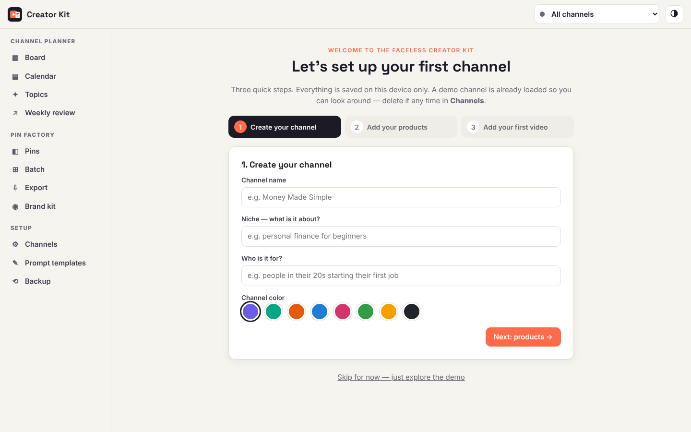
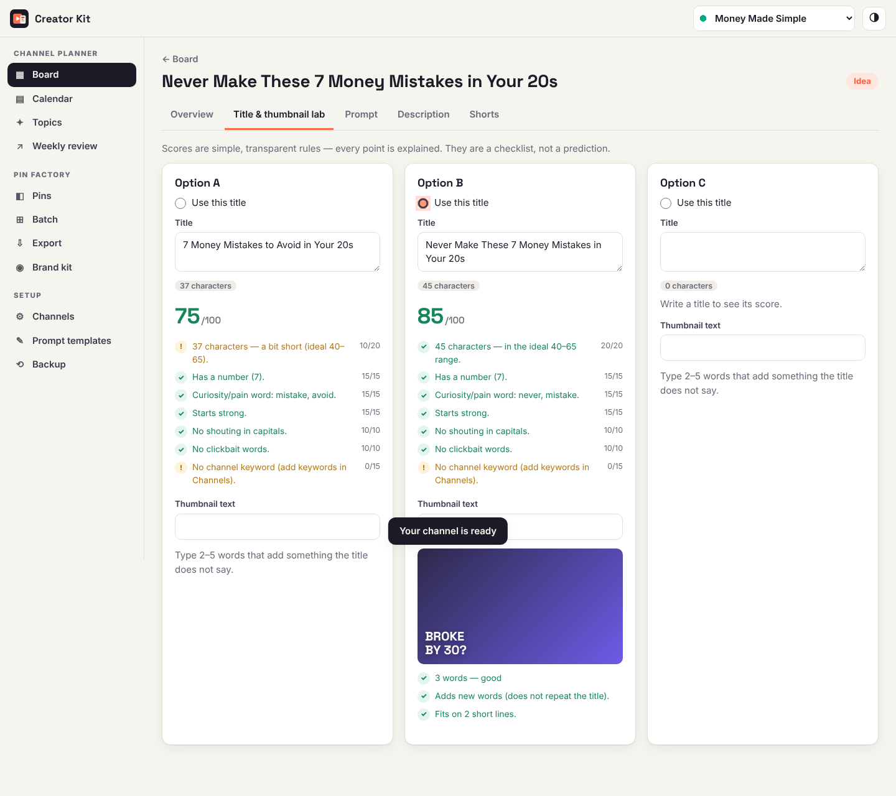

# Faceless Creator Kit — Quick Start Guide

Thank you for getting the Faceless Creator Kit. This guide shows you how to open it, install it like an app, and make your first video plan and your first batch of Pinterest pins.

[[ACCESS_CODE]]

## 1. Open the kit

1. Open this address in Chrome, Edge, Safari or Firefox (computer, tablet or phone): **{{KIT_URL}}**
2. Type your access code (above) and press **Unlock**. Capital or small letters both work.
3. Bookmark the page. You only need the code once per browser.

Your data is saved **only in this browser on this device**. Nothing is uploaded, there is no account and no tracking. That also means: if you clear your browser data, your plans are gone — so use **Backup** now and then (see section 7).

## 2. Install it like an app (optional, recommended)

- **Mac or Windows (Chrome or Edge):** click the small *Install* icon at the right end of the address bar, then **Install**. The kit gets its own window and an icon in your Dock or Start menu.
- **Mac (Safari):** menu **File → Add to Dock**.
- **iPhone / iPad:** open the address in Safari → **Share** → **Add to Home Screen**.
- **Android:** open it in Chrome → **⋮** menu → **Install app** (or *Add to Home screen*).

After the first visit the kit also works **offline**.

Each device keeps its own copy of your data. To move your work to another device, download a backup on one and restore it on the other.

## 3. First run: set up your channel

The first screen walks you through three steps:

1. **Create your channel** — name, niche, who it is for, and a color.
2. **Add your products** — the links you mention in descriptions and pins (a free download, your shop, affiliate links), plus a default link line for the top of every description.
3. **Add your first video** — just a working title.

A **demo channel** ("Night Sky Explained") is loaded so you can see every feature filled in. Delete it any time in **Channels**.

## 4. Channel Planner — quick start

- **Board:** every video moves through *Idea → Script → Voice/Avatar → Edit → Thumbnail → Scheduled → Published*. Drag a card on a computer, or use the small menu on the card (works everywhere). Typing a new idea warns you when it sounds like a video you already have.
- **Video page, Title & thumbnail lab:** write up to three titles and thumbnail texts. Each title gets a score out of 100 with every rule explained (length, number, curiosity word, strong start, no shouting, no clickbait, channel keyword). The score is a checklist, not a prediction.
- **Prompt:** pick a template (Listicle explainer, Story / insider reveal or How-to), type your points one per line, press **Copy prompt**, and paste it into the AI tool you write scripts with. Edit the templates or add your own in **Prompt templates** — including a fixed ending line that is always last.
- **Description:** hook, link line, product links, chapters (checked against YouTube's rules), disclaimer and hashtags. Press **Copy description**.
- **Shorts:** press **Make Shorts from chapters** to plan one Short per chapter, then add a hook, on-screen text and title.
- **Calendar, Topics, Weekly review:** see what is scheduled, keep an idea bank, and type in your weekly numbers to see small trend lines.

## 5. Pin Factory — quick start

**Brand kit (once per channel):** pick 3 colors (main, accent, light), a heading and body font (6 included), upload a logo or photo (shown in a circle with an optional ring), your footer text (website or handle) and a small call-to-action tag.

**One pin:** **Pins → + New pin**, choose one of the 8 templates (Bold Headline, Numbered List, Quick Tip + Tag, Recipe/Product Card, Quote, Before → After / Do vs Don't, Money Compare, Checklist). Wrap key words in `*asterisks*` to highlight them. The preview updates as you type; **Undo**, **Duplicate** and **Download PNG** are at the top.

**Many pins at once (Batch):**

1. Make a sheet with these columns: `title, headline, body, tag, template, link, board`. In *body*, separate lines with `|`. *template* can be a number 1–8 or a name like `list`.
2. Copy the rows (with the header) and paste them in **Batch**, or upload a CSV. Tip: press **Fill with an example** to see the format.
3. Press **Render pins**. Click any pin to fix it — it re-renders right away. A **!** marks text that is too long.
4. Press **Export this batch**.

## 6. Export to Pinterest (bulk upload)

Pinterest's bulk upload reads a CSV file and downloads each image **from the web**, so your images need a public address first. The **Export** screen does the rest:

1. Choose **PNG** (best quality) or **JPG** (each under 350 KB).
2. Type the **public base URL** of the folder where you will put the images (see below).
3. Optional: add **UTM tags** to your links (to see Pinterest visits in your analytics) and fill in a **schedule** (pins per day, times, start date, and "spread similar pins apart").
4. Fix anything listed in red (titles max 100 characters, descriptions max 500 — there is a button to shorten them automatically).
5. Press **Download ZIP**. It contains all images, `pinterest-bulk.csv` and a short read-me.
6. Upload the images (do not rename them), then in Pinterest choose **Create → Bulk create Pins → Upload .csv** (Pinterest may word this slightly differently) and pick the CSV.

### Free image hosting with GitHub Pages (about 5 minutes)

1. Create a free account at **github.com**.
2. Click **+ → New repository**. Name it `pins`, choose **Public**, tick **Add a README file**, and click **Create repository**.
3. Click **Add file → Upload files**, drag in all the images from the ZIP, and click **Commit changes**.
4. Open **Settings → Pages**. Under *Source* choose **Deploy from a branch**, branch **main**, folder **/ (root)**, then **Save**.
5. Wait 1–2 minutes. Your base URL is `https://YOUR-USERNAME.github.io/pins/`.
6. Check it: open the base URL plus one file name (for example `https://YOUR-USERNAME.github.io/pins/001-my-pin.png`) in your browser. If you see the pin, Pinterest can see it too.

Next time, upload new images to the same repository; the base URL stays the same. Any other host works as well (your own website, Netlify, Cloudflare Pages…) as long as the images are public.

## 7. Backup and restore

- **Backup → Download backup** saves everything (channels, videos, pins, logos, settings) in one `.json` file. Keep a copy somewhere safe.
- **Restore from a backup…** replaces everything in the kit on this device with that file.
- **Download CSV ZIP** gives you spreadsheets of your videos, Shorts, stats, notes, topics and pins.

## 8. Good to know

- **Requirements:** any modern browser (Chrome, Edge, Safari, Firefox — recent versions). No installation, no account, no subscription.
- **Privacy:** everything stays on your device. The kit makes no network calls while you use it.
- **Honest note:** the kit helps you plan and produce faster. It does not guarantee views, subscribers or income — results depend on your content and your niche.
- **Fonts:** Anton, Inter, Lora, Montserrat, Playfair Display and Space Grotesk, all under the SIL Open Font License.
