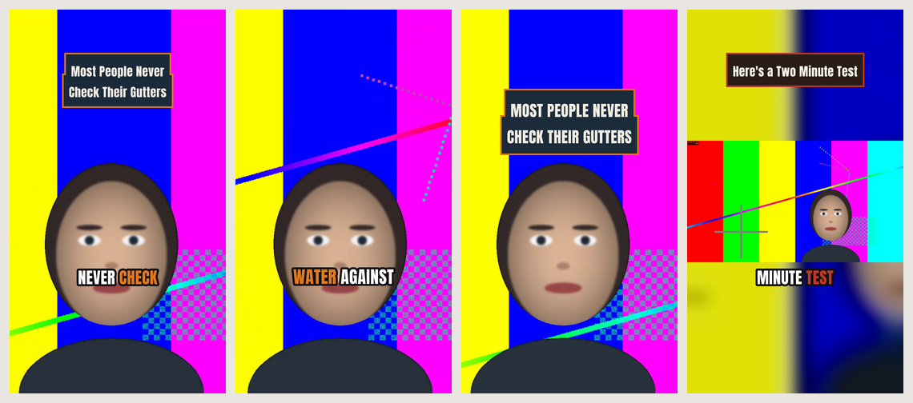
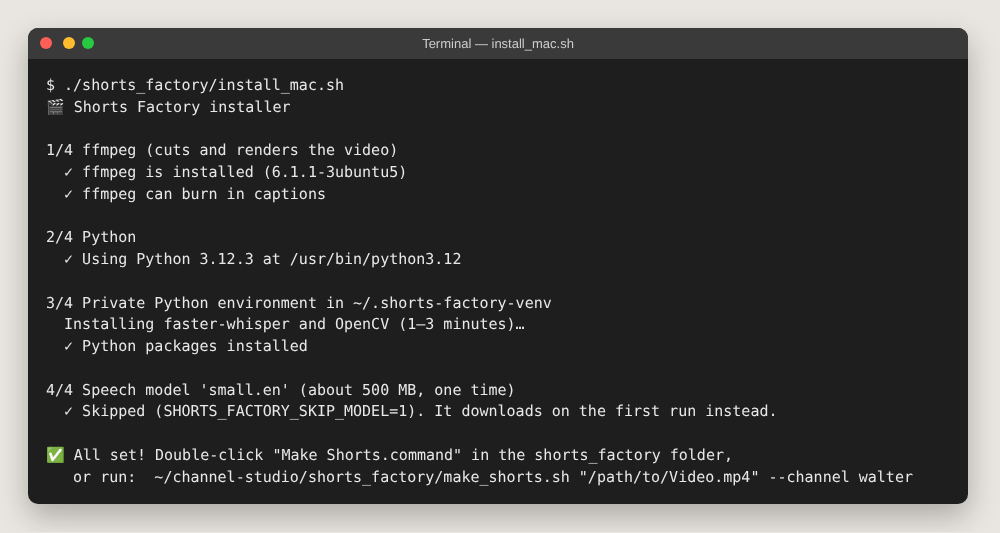
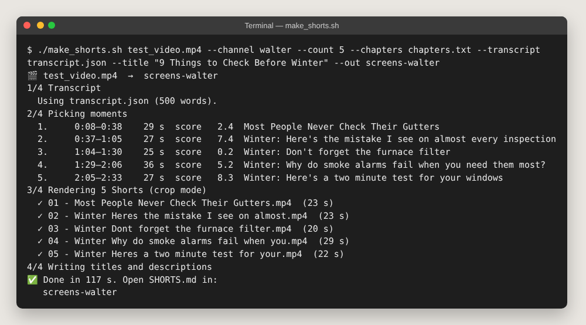
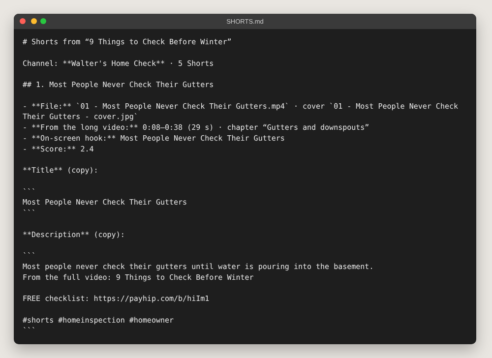
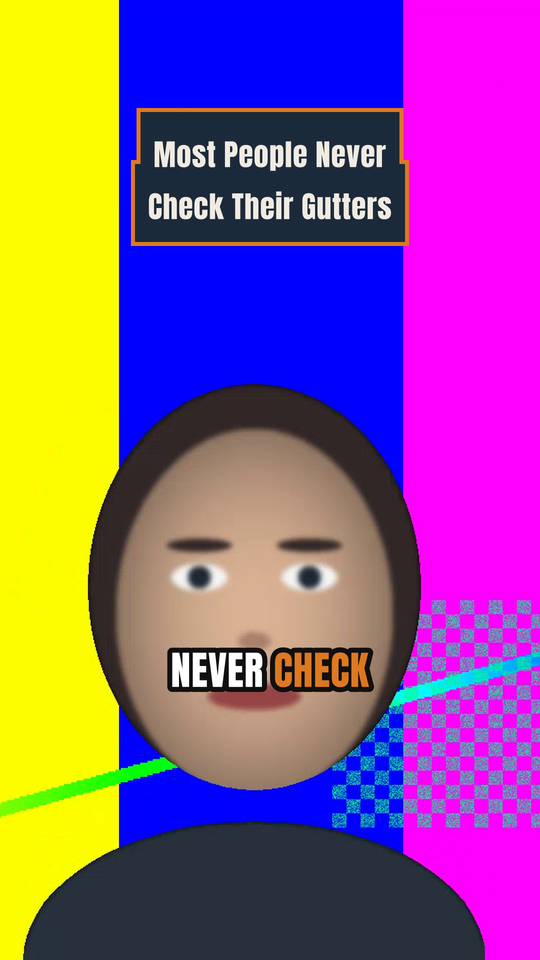
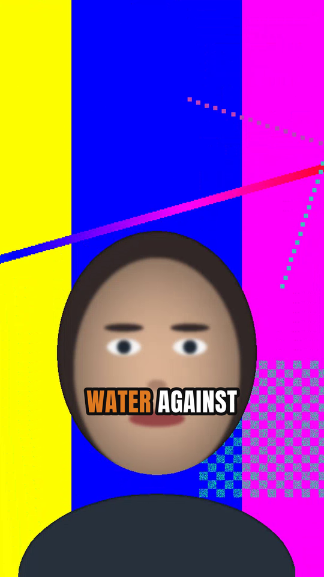
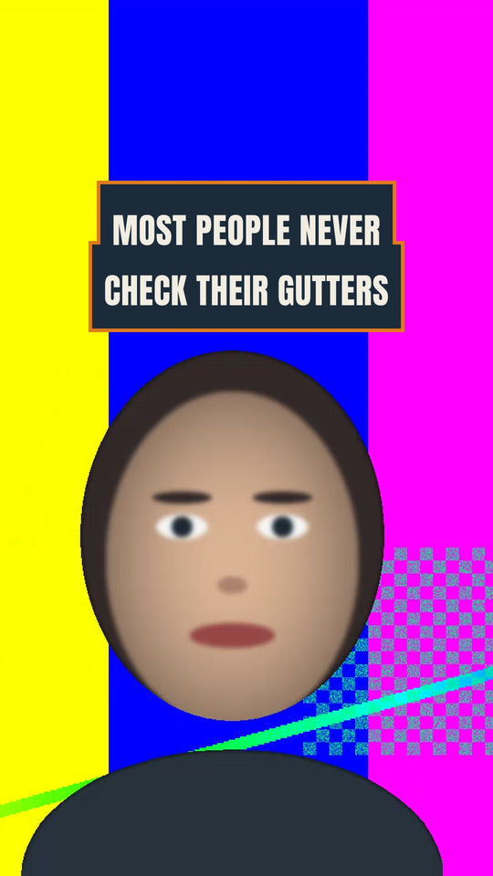
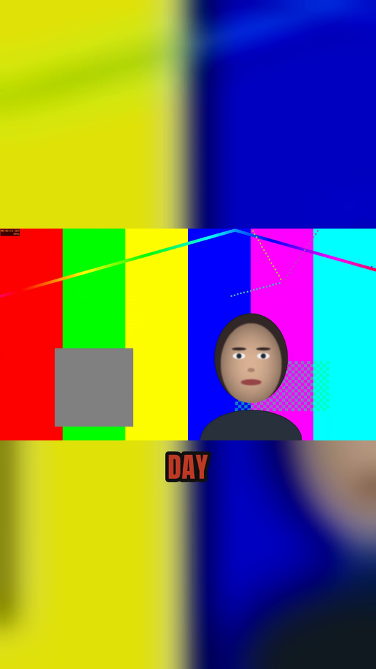

# Shorts Factory

Turn **one long video** (Walter or Sal, 8–20 minutes, 16:9) into **5–8 ready-to-post
YouTube Shorts** in a few minutes — with almost no work by hand.

For every Short you get:

- a **1080×1920 MP4** (under 60 seconds, sound levelled for phones),
- **big word-by-word captions** burned in (the word being spoken lights up in the channel color),
- a **hook bar** at the top for the first 2.5 seconds,
- a **cover picture** (JPG) with the hook text,
- a ready **title and description** (with the free-product link and `#shorts`).

It runs on your Mac. Nothing is uploaded anywhere. After the one-time install it works offline.



---

## 1. Install (one time, about 10 minutes)

1. Open **Terminal** (press ⌘ Space, type *Terminal*, press Enter).
2. If you don't have **Homebrew** yet: open <https://brew.sh>, copy the one-line command
   on that page, paste it into Terminal and press Enter. Follow what it says (it asks for your
   Mac password, and at the end it may show two "Next steps" lines — run those too).
3. Drag the **`install_mac.sh`** file from the `shorts_factory` folder into the Terminal window,
   then press Enter. (Or type `./shorts_factory/install_mac.sh` from the repo folder.)

It installs ffmpeg, a private Python setup in `~/.shorts-factory-venv`, and the speech
model (about 500 MB). It's safe to run again any time. When it's done you see **All set!**



*(This picture was made on a test computer where the model download was skipped. On your Mac,
step 4 downloads the model and says "Model downloaded — everything now works offline".)*

> **"Your ffmpeg can't draw captions"?** Run the three commands it prints (they swap in an
> ffmpeg that includes the caption library), then run the installer again.

## 2. Make Shorts — the easy way

**Double-click `Make Shorts.command`** in the `shorts_factory` folder.

1. Pick the long video in the window that opens.
2. Pick **Walter** or **Sal**.
3. Wait. A 15-minute video takes roughly 5–10 minutes on a MacBook Air
   (listening to the video is the slow part; the second time it's instant).
4. The folder with your Shorts opens by itself.

> The first time, macOS may say the file "can't be opened because it is from an unidentified
> developer". Right-click it → **Open** → **Open**. You only do this once.
>
> **Chapters (optional):** put a text file with the YouTube chapter list next to the video,
> named like the video plus `.chapters.txt` (for example `Winter Checks.chapters.txt`).
> Then the factory tries to take one Short from each chapter.

## 3. Make Shorts — from Terminal

```
./shorts_factory/make_shorts.sh "/path/to/Video.mp4" --channel walter      # or: --channel sal
```



| Option | What it does | Default |
|---|---|---|
| `--count 6` | how many Shorts (1–10) | 6 |
| `--chapters chapters.txt` | the YouTube chapter list (`0:00 Intro` per line); one Short per chapter where possible | none |
| `--mode crop` | fill the screen, the picture follows the face | `crop` |
| `--mode blur` | show the whole 16:9 picture in the middle, blurred copy behind it | |
| `--min 20 --max 55` | shortest / longest Short in seconds (never more than 58) | 20 / 55 |
| `--out "folder"` | where to save | `<video name> - SHORTS` next to the video |
| `--title "…"` | the long video's YouTube title (used for keywords and titles) | the file name |
| `--model small.en` | speech model: `tiny.en` (fast), `small.en`, `medium.en` (best, slow) | `small.en` |
| `--lang en` | spoken language (only for models without `.en`) | `en` |
| `--plan-only` | pick the moments and write the text files, but don't make videos | |
| `--no-captions` | no burned-in captions (hook bar stays) | |

**Tip:** name the video file like its YouTube title (`9 Things to Check Before Winter.mp4`) or
pass `--title`. The Short titles must contain a word from the long title, and the scoring
prefers moments that talk about it.

## 4. What you get

In the `… - SHORTS` folder:

| File | What it is |
|---|---|
| `01 - <title>.mp4` … | the Shorts, ready to upload |
| `01 - <title> - cover.jpg` … | cover picture for each Short |
| `SHORTS.md` | **open this first**: title and description for each Short, ready to copy |
| `shorts.csv` | the same in a spreadsheet (opens in Numbers / Excel) |
| `report.md` | why each moment was picked (the score and every reason) + the runners-up |
| `channel-studio-import.json` | the plan in Channel Studio's Shorts fields (hook, range, on-screen text, title, description, status "cut") |
| `transcript.json` | the saved transcript — re-runs skip the listening step. Delete it to listen again. |



Each description is: one line from the Short, "From the full video: …", the channel's free
link, then `#shorts` and two channel hashtags.

- Walter → `FREE checklist: https://payhip.com/b/hiIm1`
- Sal → `FREE 25 Rules for Eating Out: https://payhip.com/b/dnY7F`

> Channel Studio doesn't have an "Import Shorts JSON" button yet; until then copy the
> fields from `SHORTS.md` into the video's **Shorts** tab. The JSON is ready for when it does.

### What the Shorts look like

| Walter · hook bar (first 2.5 s) | Walter · captions | Walter · cover | Sal · blur mode |
|---|---|---|---|
|  |  |  |  |

*(Made from the synthetic test video — a drawn face on a test pattern with a robot voice —
so the pictures are colorful on purpose.)*

## 5. How the moments are picked

The factory listens to the video (Whisper, on your Mac), splits it into sentences, and looks at
every stretch of **whole sentences** that lasts 20–55 seconds. Each stretch gets points:

- **Strong first sentence:** numbers, "never", "most people", "mistake", "check", "don't",
  "here's", questions → **+**
- **Stands on its own:** starting with "as I said", "next", "in this video", "and/but/so" → **−**;
  ending on a full stop → **+**, ending mid-sentence or on an unanswered question → **−**
- **Energy:** more words per second → **+**
- **On topic:** words from the long video's title (and the chapter title) → **+**
- **Not intro/outro/plug:** the first 20 seconds, "welcome back", "subscribe", "thanks for
  watching", "link in the description", "checklist", "cookbook", "sponsor" … → **−**
  (links can't be clicked in a Short anyway)
- **Length:** 30–45 seconds → small **+**

Then it takes the best ones that don't overlap (with chapters: first the best of each chapter).
Every point is listed in `report.md`, so you can see — and disagree with — each choice.

The **hook bar** is the first sentence cut to 6 words or fewer, in Title Case.
The **captions** show 1–3 words at a time in the Anton font (free, SIL Open Font License,
in `fonts/`), placed above the area where YouTube puts its buttons and title.
The **crop** finds the face with OpenCV every second, smooths the movement, and follows it;
if no face is found it simply crops the middle.

## 6. Problems?

| You see | Do this |
|---|---|
| `ffmpeg is not installed` | run `install_mac.sh` again (needs Homebrew) |
| `Your ffmpeg can't draw captions` | run the 3 commands it prints |
| `Downloading the speech model` and then an error | you're offline on the first run — connect once, or run the installer |
| `Only 4 good, non-overlapping moments found` | the video is short or has few clean stretches; try `--min 15` |
| A Short starts or ends awkwardly | look at `report.md`, then try `--chapters` or other `--min`/`--max` values |
| Captions look wrong after changing the video | delete `transcript.json` in the SHORTS folder |

## For developers

```
python3 -m unittest discover -s shorts_factory/tests      # unit + end-to-end tests (~2 min)
ruff check shorts_factory                                 # lint
python3 shorts_factory/tests/make_screens.py [--install]  # re-make docs/screens/shorts-*.png
```

The end-to-end test builds a synthetic 3-minute 16:9 video (ffmpeg `testsrc2` + a drawn face
that drifts sideways + `espeak-ng` speech when available) and its exact transcript, then runs
the whole pipeline with `--transcript` (so Whisper isn't needed). It checks: the number of
Shorts, 1080×1920, 20–60 s, H.264 + AAC audio, captions and hook bar really burned in (frames
compared with and without), the crop following the face, no overlapping source ranges,
valid CSV/MD/JSON, titles ≤ 100 characters with a title keyword, and blur mode for Sal.

Code: `shortsfactory/` — `transcribe.py` (Whisper + cache + sentences), `moments.py`
(candidates, scores, picking), `captions.py` (ASS subtitles), `face.py` (face tracking),
`render.py` (ffmpeg), `metadata.py` (titles, descriptions, output files), `cli.py`.
Dependencies: ffmpeg with libass, `faster-whisper`, `opencv-python-headless` (below 5 — OpenCV 5
moved the face detector out).
